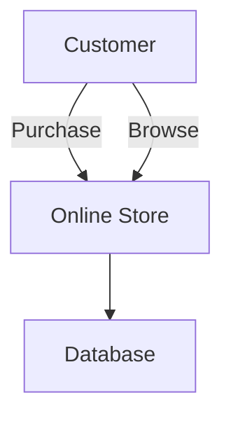
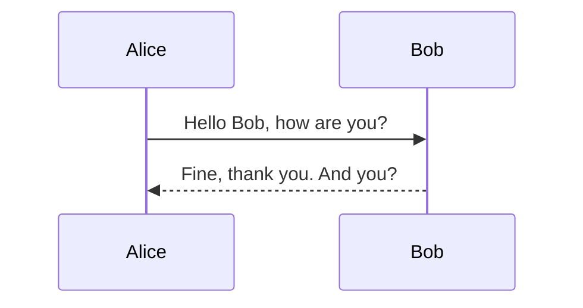
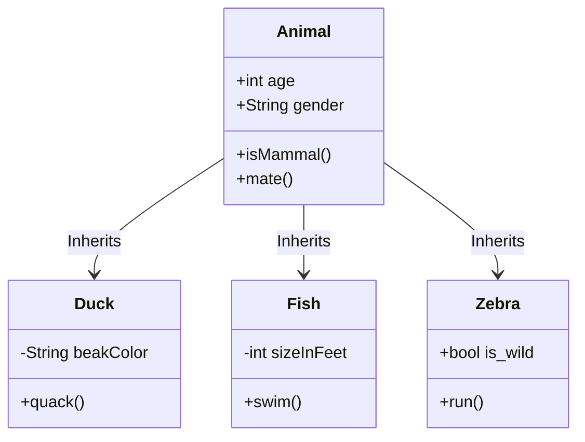
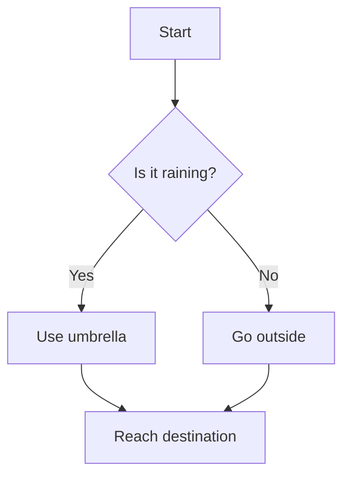
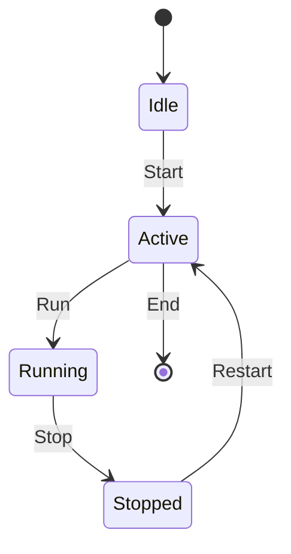

UML（Unified Modeling Language）は、ソフトウェアの設計やシステムの構造を視覚的に表現するための標準的なモデリング言語です。以下は、よく使用されるUMLダイアグラムの一部です。

- **Usecase Diagrams（ユースケース図）**  
  システムの機能とその機能を利用するアクター（ユーザーや外
  部システム）との関係を示す図。

- **Sequence Diagrams（シーケンス図）**  
  オブジェクト間のメッセージのやり取りの順序を時系列で示す図。

- **Class Diagrams（クラス図）**  
  システム内のクラスやインターフェース、それらの関係を示す図。

- **Activity Diagrams（アクティビティ図）**  
  ワークフローやプロセスの流れを示す図。

- **Statemachine Diagrams（ステートマシン図）**  
  オブジェクトの状態の変化と、その変化を引き起こすイベントや条件を示す図。

これらのダイアグラムは、ソフトウェア開発のさまざまなフェーズで使用され、設計の明確化、チーム内のコミュニケーションの向上、ドキュメンテーションの作成などに役立ちます。

## 1: UMLとは何の略でしょうか？

1. Unified Modeling Language
2. Universal Markup Language
3. Unified Markup Language
4. Universal Modeling Language

:::details 解答

1. Unified Modeling Language
UMLは「Unified Modeling Language」の略で、ソフトウェアの設計やシステムの構造を視覚的に表現するための標準的なモデリング言語です。
:::

## 2: シーケンス図は何を表現するための図でしょうか？

1. オブジェクト間のメッセージのやり取りの順序
2. システムの機能とその機能を利用するアクターとの関係
3. システム内のクラスやインターフェース、それらの関係
4. ワークフローやプロセスの流れ

:::details 解答

1. オブジェクト間のメッセージのやり取りの順序
シーケンス図はオブジェクト間のメッセージのやり取りの順序を時系列で示す図です。
:::

## 3: アクティビティ図はどのような場面で使用されるでしょうか？

1. オブジェクトの状態の変化を示す場面
2. システムの機能を示す場面
3. ワークフローやプロセスの流れを示す場面
4. クラスの関係性を示す場面

:::details 解答
3. ワークフローやプロセスの流れを示す場面
アクティビティ図はワークフローやプロセスの流れを示す図です。
:::
