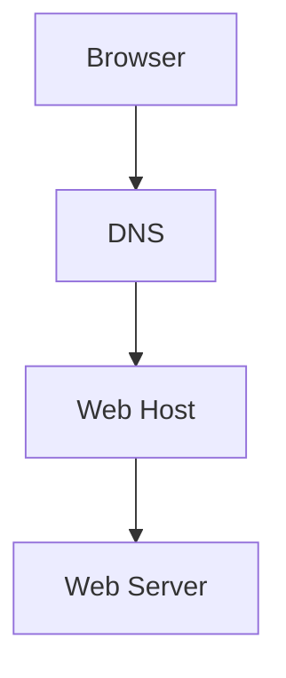

## Internet

- **インターネットの仕組み**
- **HTTP とは**
- **ブラウザの動作**
- **DNS の動作**
- **ドメイン名とは**
- **ホスティングとは**

### 1. インターネットはどのように動作しますか？

:::details Click for Answer

インターネットは、複数のコンピュータやデバイスが相互に通信するためのネットワークシステムです。これにより、情報の共有やデータの送受信が可能になります。例えば、あなたがブラウザで `www.example.com` と入力すると、そのリクエストはサーバーに送信され、対応するウェブページの情報があなたのコンピュータに返されます。

:::

### 2. HTTP とは何ですか？その主な機能や役割について簡潔に説明してください。

:::details Click for Answer

HTTP（HyperText Transfer Protocol）は、インターネット上でウェブページやその他のリソースを転送するためのプロトコルです。ウェブブラウザとウェブサーバー間の通信を可能にするための基盤となる技術です。

HTTPS（HTTP Secure）は、HTTP の安全なバージョンで、データの暗号化を提供します。これにより、ユーザーとウェブサイト間の通信が第三者によって傍受されるリスクを軽減します。HTTPS は、特にオンラインバンキングやショッピングなどのセキュリティが必要なトランザクションで使用されます。

簡単に言えば、HTTP は情報をオープンに転送するのに対し、HTTPS はその情報を暗号化して転送します。

:::

### 3. ウェブブラウザはどのように動作しますか？

:::details Click for Answer

ウェブブラウザは、ユーザーが指定した URL のウェブページを取得し、その内容を表示するソフトウェアです。HTML, CSS, JavaScript などのコードを解釈して、ユーザーに視覚的に表示します。例えば、`www.example.com` のウェブページにアクセスすると、ブラウザはそのページの HTML を解析し、テキストや画像を正しく配置して表示します。

:::

### 4. DNS がどのように動作するか、簡潔に説明してください。

:::details Click for Answer
DNS（Domain Name System）は、インターネット上のドメイン名と IP アドレスの対応関係を管理するシステムです。人間は数字の羅列である IP アドレスよりも、`www.example.com` のようなドメイン名の方が覚えやすいため、DNS はこの変換を行います。

具体的な動作としては、以下のステップがあります：

1. **リクエストの開始**: ユーザーがブラウザに`www.example.com`を入力すると、コンピュータはこのドメイン名に対応する IP アドレスを知るためのリクエストを開始します。
2. **ローカルキャッシュの確認**: コンピュータは最初に、以前にアクセスしたサイトのドメイン名と IP アドレスの情報をローカルキャッシュに保存しているので、そこを最初に確認します。
3. **再帰的な問い合わせ**: キャッシュに情報がない場合、リクエストは再帰的な DNS サーバーに送信されます。このサーバーは、ドメイン名の情報を持っている権威サーバーを探し出します。
4. **権威サーバーへの問い合わせ**: 再帰的なサーバーは、ドメインの情報を持つ権威サーバーに問い合わせを行い、対応する IP アドレスを取得します。
5. **IP アドレスの返却**: 権威サーバーから取得した IP アドレスは、再帰的なサーバーを経由してユーザーのコンピュータに返却され、ブラウザはその IP アドレスに対応するサイトにアクセスします。

このように、DNS はインターネット上のドメイン名と IP アドレスの変換を効率的に行うための重要なシステムとなっています。

:::

### 5. ドメイン名の主な目的や役割は何ですか？

:::details Click for Answer

ドメイン名は、インターネット上のリソースの一意のアドレスとして機能します。これにより、ユーザーはウェブサイトやサービスに簡単にアクセスできます。例えば、`www.example.com` というドメイン名を使用すると、ユーザーはブラウザにそのアドレスを入力するだけで、関連するウェブサイトにアクセスできます。

:::

### 6. ウェブホスティングとは何ですか？その重要性について説明してください。

:::details Click for Answer

ウェブホスティングは、ウェブサイトのファイルやデータを保存し、インターネット上で公開するためのサービスです。これにより、ユーザーは世界中からウェブサイトにアクセスできます。例えば、あなたがオンラインショップを開設したい場合、ウェブホスティングサービスを利用して、商品の情報や画像などのデータをインターネット上に公開することができます。

:::

## Internet 理解度ハンズオン

### 1. インターネットはどのように動作しますか？

インターネットは、複数のコンピュータやデバイスが相互に通信するためのネットワークシステムです。以下のコマンドを使用して、特定のドメインや IP アドレスに到達できるかを確認できます。

```bash
ping www.google.com
```

### 2. HTTP とは何ですか？

HTTP は、ウェブページやその他のリソースをインターネット上で転送するためのプロトコルです。以下のコマンドを使用して、HTTP リクエストを送信し、レスポンスを取得できます。

```bash
curl http://www.example.com
```

### 3. ウェブブラウザはどのように動作しますか？

ウェブブラウザは、ユーザーが指定した URL のウェブページを取得し、その内容を表示するソフトウェアです。ブラウザの開発者ツールを使用して、HTTP リクエストやレスポンス、ページのレンダリングなどのプロセスを確認できます。

### 4. DNS がどのように動作するか？

DNS は、ドメイン名を IP アドレスに変換するシステムです。以下のコマンドを使用して、ドメイン名の IP アドレスを取得できます。

```bash
nslookup www.example.com
```

または

```bash
dig www.example.com
```

### 5. ドメイン名の主な目的や役割は何ですか？

ドメイン名は、インターネット上のリソースの一意のアドレスとして機能します。以下のコマンドを使用して、ドメイン名の所有者や登録情報を確認できます。

```bash
whois example.com
```

### 6. ウェブホスティングとは何ですか？

ウェブホスティングは、ウェブサイトのファイルやデータを保存し、インターネット上で公開するためのサービスです。FTP クライアントを使用して、ホスティングサーバーにファイルをアップロードできます。

#### 処理の図:



この図は、ブラウザがウェブページを取得する際の基本的なプロセスを示しています。ブラウザはまず DNS にドメイン名の IP アドレスを問い合わせ、その後、その IP アドレスのウェブホストに接続して、ウェブサーバーからページの内容を取得します。
